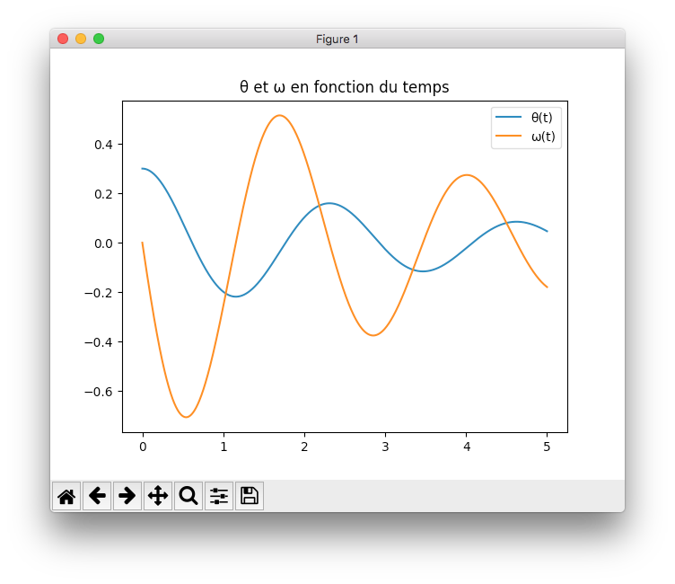
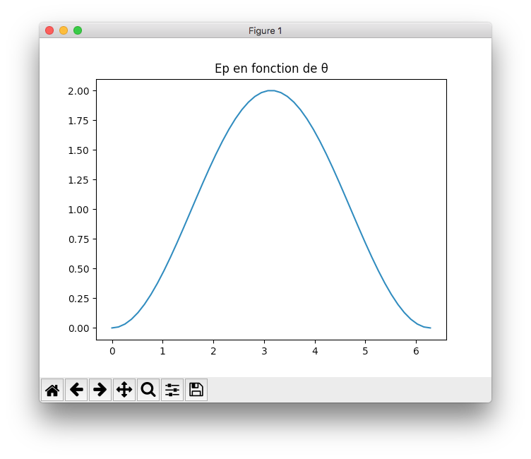
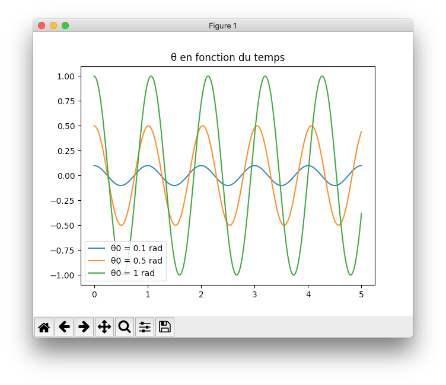

# TP 21

## Installation préalable

Modules requis :
- matplotlib
- numpy
- scipy

Installation :

```bash
python3 -m pip install matplotlib numpy scipy
```

## Exécution des scripts

### Exemple du cours (oscillateur harmonique)

```bash
python3 exemple_oscillateur.py
```



### Ep(θ)

```bash
python3 ep_de_theta.py
```



### Résolution de l'équation linéaire

```bash
python3 resolution_equa_diff_lineaire.py
```


